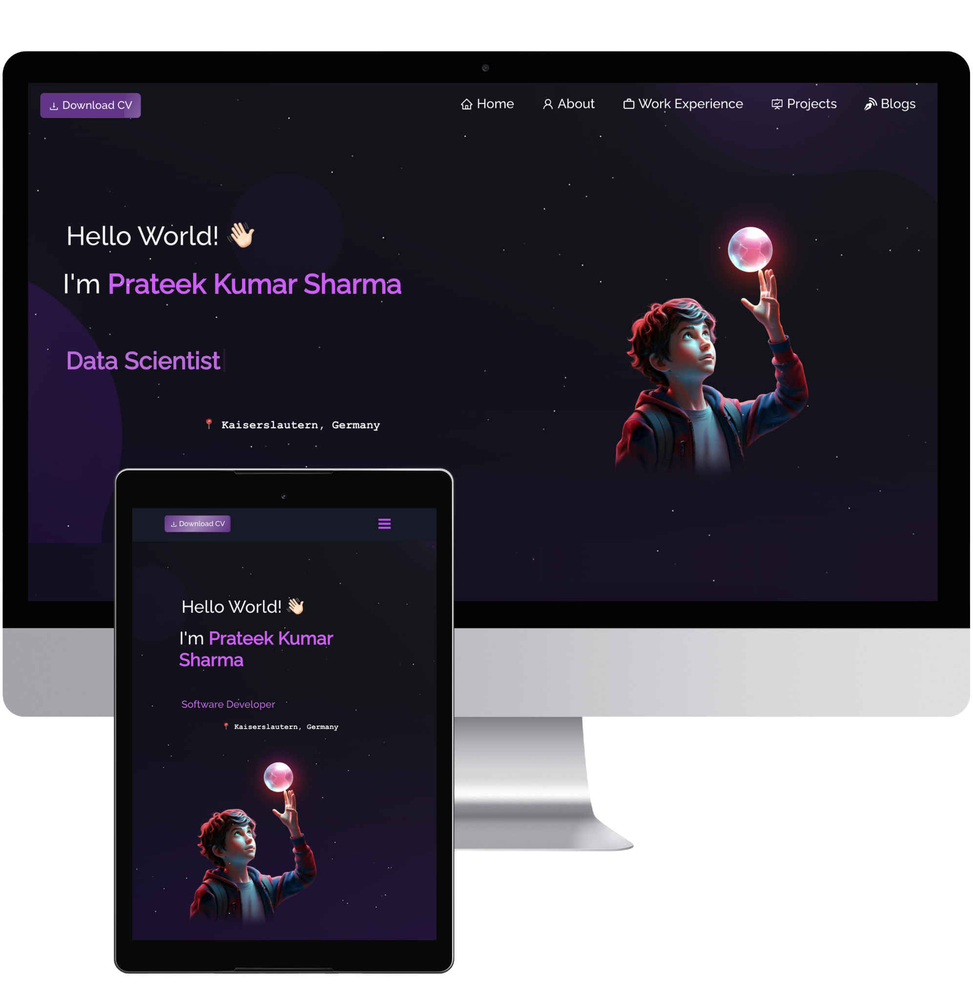

# Welcome to Prateek Kumar Sharma's Portfolio
<h2 align="center">
  🚀 Portfolio Website 
  Check it out: <a href="https://prateekkumarsharma.vercel.app/" target="_blank">PrateekKumarSharma.com</a>
</h2>

  

 

<h3 align="center">
    🔹 <a href="https://github.com/prateeksharma0112/Portfolio/issues">Report Bug</a> &nbsp; &nbsp;
    🔹 <a href="https://github.com/prateeksharma0112/Portfolio/issues">Request Feature</a>
</h3>

## 📌 TL;DR (Too Long; Didn’t Read)

Feel free to fork this repository and make any modifications you like! If you use it, please give credit by linking back to [prateeksharma0112](https://github.com/prateeksharma0112/Portfolio). Thanks for supporting open-source development!

## 🔧 Built With

This personal portfolio, <a href="https://prateekkumarsharma.vercel.app/" target="_blank">PrateekKumarSharma.com</a>, features some of my GitHub projects, my resume, and an overview of my technical skills. 

The project was built using the following technologies:

- **React.js**: For building the dynamic frontend
- **Node.js** & **Express.js**: For backend server functionality
- **CSS3**: For custom styling and design
- **VSCode**: My preferred code editor
- **Vercel**: For deployment

## ✨ Key Features

- **Multi-Page Layout**: A clean and organized multi-page structure for a comprehensive user experience.
- **Custom Styling**: Styled with **React-Bootstrap** and **CSS** for easy customization and flexibility in design.
- **Fully Responsive**: Optimized for desktop, tablet, and mobile devices to ensure a seamless experience across all screen sizes.

## 🚀 Getting Started

To get started with this portfolio project, clone this repository to your local machine. You will need **Node.js** and **Git** installed globally.

Follow the instructions below to set up the project locally.

## 🛠 Installation and Setup

1. **Install Dependencies**:  
   Run `npm install` to install the required dependencies.

2. **Run the Development Server**:  
   In the project directory, run `npm start` to launch the app in development mode.  
   Open [http://localhost:3000](http://localhost:3000) in your browser to view it.  
   The page will automatically reload if you make any changes.

3. **Start Developing**:  
   You can now edit the components and customize the content to suit your needs.

## ✏️ Usage Instructions

To get started with customizing your portfolio, open the `/src/components/` directory.  
Here, you will find all the individual components used in the website. Edit the content within these components to personalize your portfolio.

### 🌟 Show Your Support

If you like this project, give it a ⭐ on GitHub!
